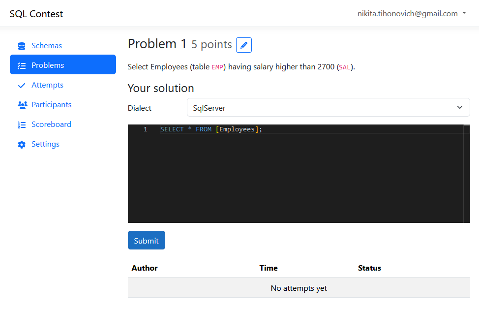

# SQL-contest

An application for hosting SQL contests.



## Installation

1. Clone the repository
2. Configure the application by either creating an appsettings.json file in diploma/diploma/ directory or by specifying respective environment variables prefixed with `Contester_` in compose.yaml. An example of appsettings.json file is appsettings.Example.json. Example of environment variables method:
```yaml
...
    environment:
      - Contester_Email__Host=smtp.gmail.com
      - Contester_Email__Port=465
...
```
3. In diploma/ClientApp/src/environments/environment.prod.ts change basePath to match your server address.
4. Create certs directory in diploma/ and put .pfx certificate file there. Specify the password in environment variables.
5. Run `docker compose up sql_server_db` and `docker compose up oracle_db` and wait for the databases to start.
6. Build and run docker container with `docker compose up --build web`. Database connections will be established automatically.

## Thanks

This project contains significant portions of code generated by [swagger-codegen](https://github.com/swagger-api/swagger-codegen) in the `ClientApp/src/generated/client` directory.
